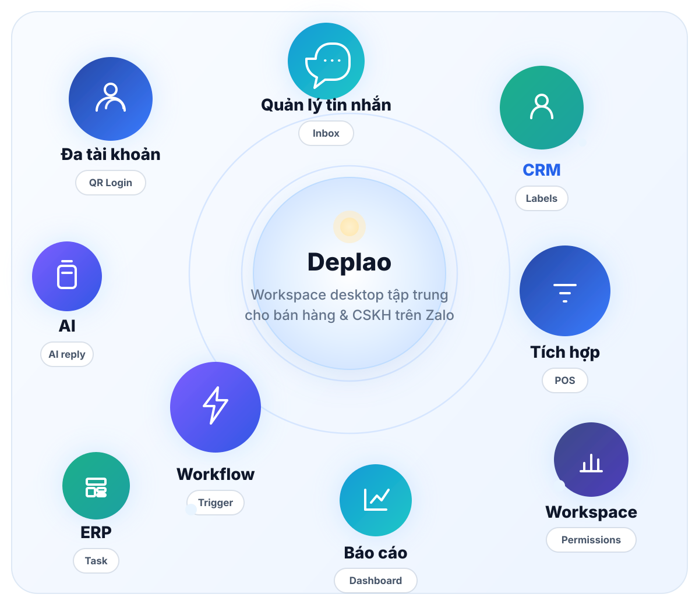
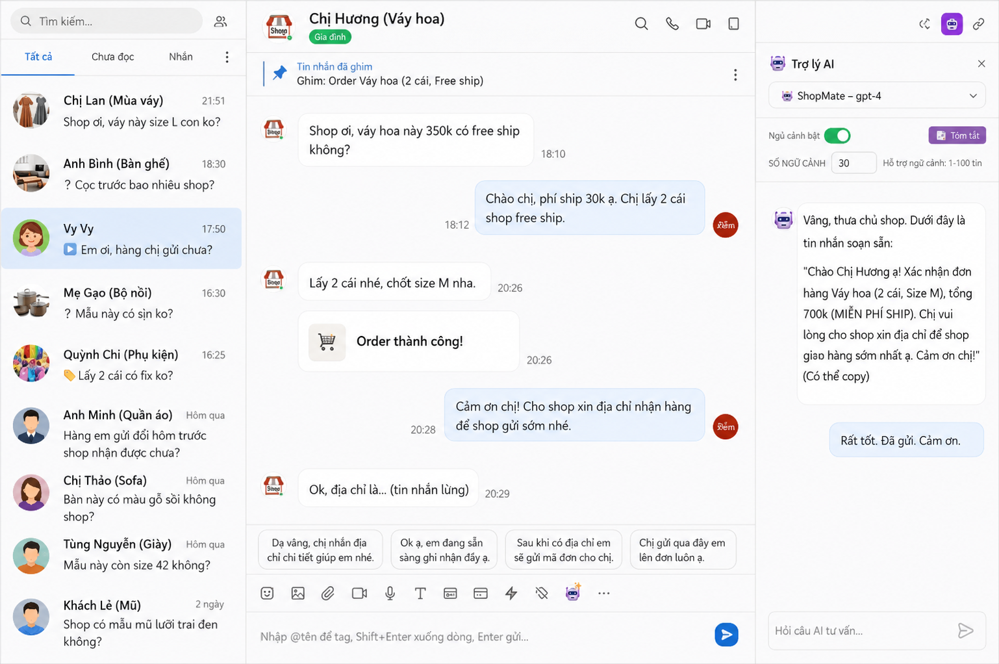
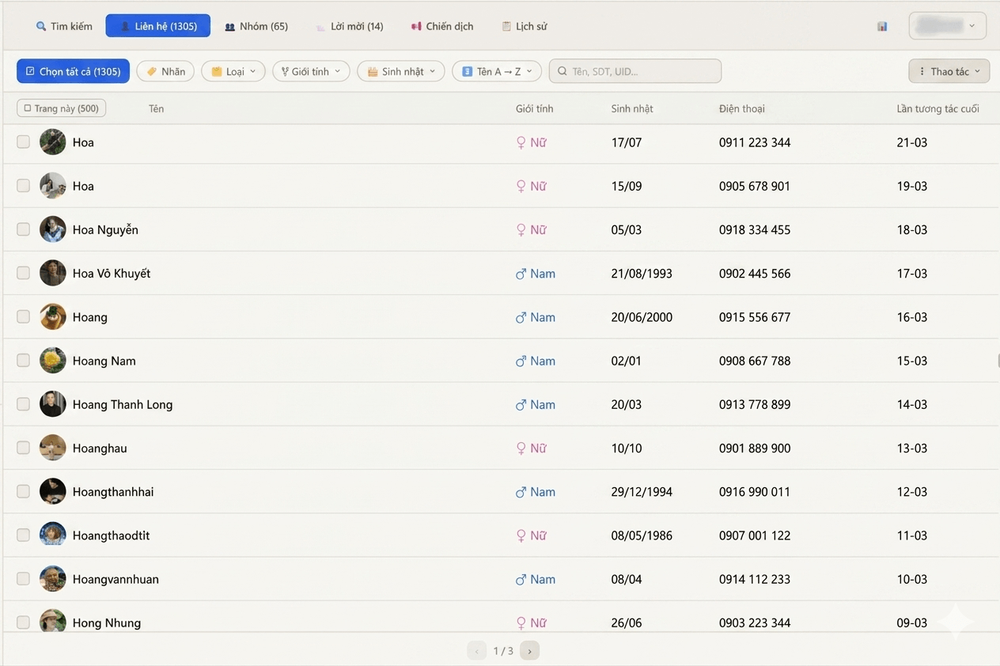
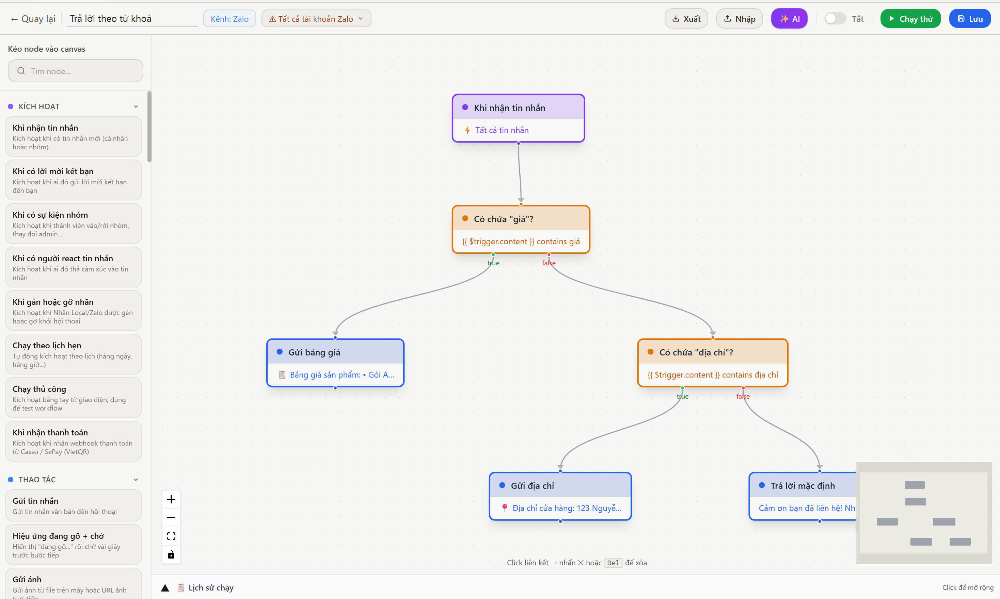
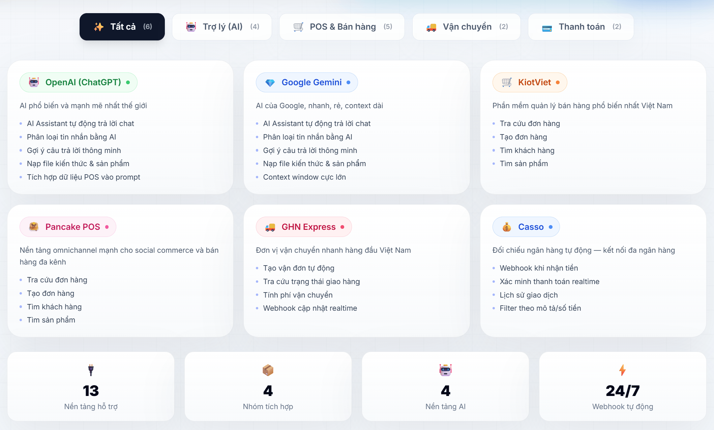
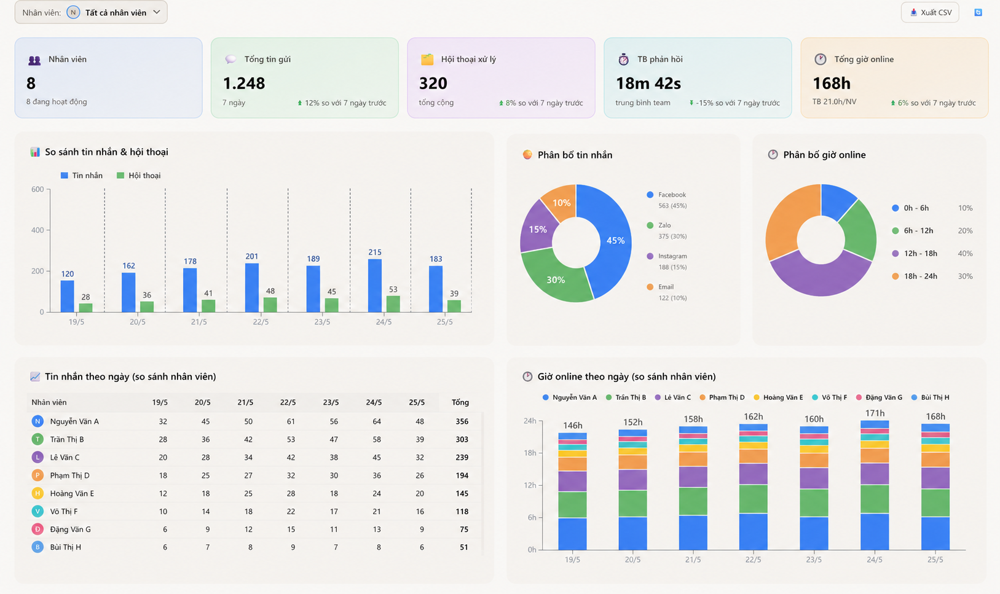
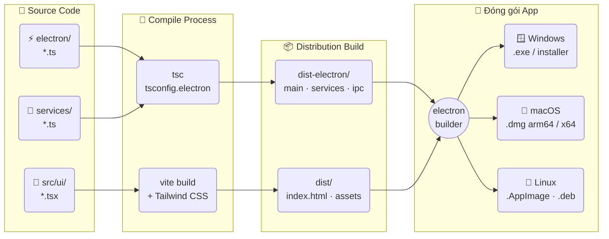
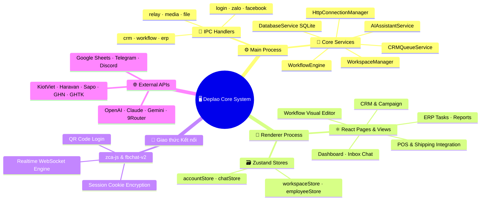
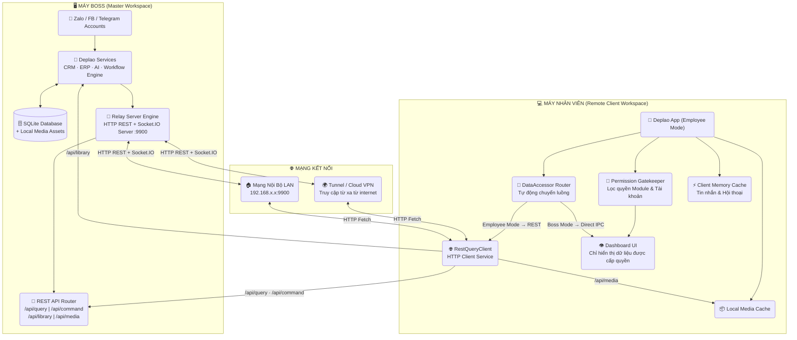

<div align="center">


# Deplao

### **Phần mềm Desktop quản lý đa tài khoản Zalo, Facebook & Telegram**
**Tích hợp CRM · MARKETING · ERP · POS · WORKFLOW · TRỢ LÝ AI — Vận hành tập trung trong 1 ứng dụng duy nhất**

[🌐 Website Chính Thức](https://deplaoapp.com/) &nbsp;•&nbsp; [🇬🇧 English Version](./README.en.md) &nbsp;•&nbsp; [💬 Báo Lỗi / Góp Ý](https://github.com/longlo2k3/deplao/issues)

<br/>

[](https://github.com/longlo2k3/deplao/releases)
[](https://github.com/longlo2k3/deplao/releases)
[](https://www.electronjs.org/)
[](https://react.dev/)
[](https://www.typescriptlang.org/)
[](./LICENSE)

<br/>

<p align="center">
  <a href="#-tải-xuống-phiên-bản-mới-nhất">📥 Tải xuống</a> &nbsp;•&nbsp;
  <a href="#-điểm-nổi-bật">✨ Điểm nổi bật</a> &nbsp;•&nbsp;
  <a href="#-xem-nhanh-giao-diện">🖼️ Giao diện</a> &nbsp;•&nbsp;
  <a href="#-các-nhóm-tính-năng-chính">🧩 Tính năng</a> &nbsp;•&nbsp;
  <a href="#-sơ-đồ-kiến-trúc--luồng-hoạt-động">🗺️ Kiến trúc</a> &nbsp;•&nbsp;
  <a href="#-công-nghệ--ngôn-ngữ-sử-dụng">🛠️ Công nghệ</a> &nbsp;•&nbsp;
  <a href="#-cài-đặt--phát-triển">📦 Cài đặt</a> &nbsp;•&nbsp;
  <a href="#-bảo-mật--dữ-liệu">🔒 Bảo mật</a>
</p>

</div>

---

## 📥 Tải xuống phiên bản mới nhất

<table>
  <tr>
    <td align="center" width="50%">
      <a href="https://github.com/longlo2k3/deplao/releases/latest/download/Deplao-Setup-26.8.4.exe">
        <br/>
        <sub><strong>Deplao-Setup-26.8.4.exe</strong></sub>
      </a>
    </td>
    <td align="center" width="50%">
      <a href="https://github.com/longlo2k3/deplao/releases/latest/download/Deplao-26.8.4-arm64.dmg">
        <br/>
        <sub><strong>Deplao-26.8.4-arm64.dmg</strong> (M1 / M2 / M3 / M4)</sub>
      </a>
    </td>
  </tr>
  <tr>
    <td align="center" width="50%">
      <a href="https://github.com/longlo2k3/deplao/releases/latest/download/Deplao-26.8.4.AppImage">
        <br/>
        <sub><strong>Deplao-26.8.4.AppImage</strong> (Mọi Distro Linux)</sub>
      </a>
    </td>
    <td align="center" width="50%">
      <a href="https://github.com/longlo2k3/deplao/releases/latest/download/Deplao-26.8.4.dmg">
        <br/>
        <sub><strong>Deplao-26.8.4.dmg</strong> (Chip Intel)</sub>
      </a>
    </td>
  </tr>
</table>

<p align="center">
  👉 <strong><a href="https://github.com/longlo2k3/deplao/releases">Xem danh sách tất cả bản phát hành (Releases)</a></strong>
</p>

<details>
<summary><b>⚠️ Lưu ý khi mở file cài đặt trên Windows / macOS / Linux (Chưa Ký Chứng Chỉ Code Signing)</b></summary>

<br/>

> [!NOTE]
> Do dự án phát hành mã nguồn mở và chưa đăng ký chứng chỉ Code Signing thương mại, hệ điều hành có thể hiển thị cảnh báo bảo vệ lần đầu mở ứng dụng.

### 🪟 Windows (.exe)
Khi chạy file `.exe`, Windows SmartScreen có thể hiển thị cảnh báo **"Windows protected your PC"**:
1. Click **More info** (Thông tin thêm).
2. Chọn **Run anyway** (Vẫn chạy).

### 🍎 macOS (.dmg)
Khi mở file `.dmg`, macOS có thể báo **"cannot be opened because it is from an unidentified developer"**:
- **Cách 1:** Click chuột phải (hoặc `Control + Click`) vào ứng dụng → chọn **Open** → Nhấn **Open** lần nữa.
- **Cách 2:** Vào **System Settings → Privacy & Security** → Kéo xuống mục Security → Nhấn **Open Anyway**.

### 🐧 Ubuntu / Linux (.AppImage & .deb)
Cho phép thực thi và chạy ứng dụng từ Terminal:
```bash
chmod +x Deplao-*.AppImage
./Deplao-*.AppImage
```
> [!TIP]
> Nếu gặp lỗi FUSE trên Ubuntu 22.04+: `sudo apt install libfuse2`  
> Hoặc cài đặt gói Debian: `sudo dpkg -i Deplao_*_amd64.deb`

</details>

---

<p align="center">
  
</p>

---

## 🚀 Deplao là gì?

**Deplao** là trung tâm vận hành Desktop chuyên nghiệp dành cho doanh nghiệp, chủ shop, agency và đội ngũ bán hàng/chăm sóc khách hàng trực tuyến. App kết hợp 5 tầng giải pháp mạnh mẽ trong 1 workspace duy nhất:

- 📱 **Trung tâm Zalo & Đa tài khoản:** Quản lý không giới hạn tài khoản Zalo, Facebook, Telegram Bot/User, gộp inbox thông minh.
- 👥 **Quản lý khách hàng (CRM):** Phân loại nhãn 2 chiều, lưu thông tin chi tiết, quét thành viên nhóm ẩn & chạy chiến dịch CSKH.
- ⚙️ **Tự động hóa Workflow & AI:** Trình thiết kế quy trình kéo-thả no-code, tích hợp AI chatbot trả lời & kích hoạt hành động 24/7.
- 🔗 **Tích hợp kênh bán hàng:** Kết nối POS (KiotViet, Haravan, Sapo), đơn vị vận chuyển (GHN, GHTK), cổng thanh toán (Sepay, Casso).
- 🧑‍💼 **ERP & Vận hành nhân viên:** Quản trị nội bộ, giao việc, báo cáo hiệu suất và phân quyền Boss ↔ Nhân viên qua mạng LAN / WAN REST API.

---

## ✨ Điểm nổi bật

- 👤 **Đa tài khoản không giới hạn:** Đăng nhập đồng thời nhiều tài khoản Zalo, Facebook, Telegram. Chuyển đổi siêu tốc không cần đăng xuất.
- 💬 **Inbox hợp nhất (Unified Inbox):** Gom hội thoại từ tất cả tài khoản vào 1 giao diện tập trung, tự động nhận diện và gộp khách trùng.
- 👥 **CRM & Quét thành viên nhóm:** Quản lý liên hệ, nhãn, ghi chú. Tính năng quét thành viên nhóm ẩn/chưa tham gia để khai thác khách hàng tiềm năng.
- ⚙️ **Workflow kéo-thả trực quan:** Xây dựng quy trình tự động hóa với Node, Trigger, Action hoặc dùng AI sinh Workflow tự động.
- 🤖 **Trợ lý AI đa nền tảng:** Tích hợp OpenAI, Claude, Gemini, DeepSeek, Grok và Local Gateway (9Router). Hỗ trợ chatbot 24/7 & gợi ý tin nhắn.
- 🔗 **Tích hợp hệ sinh thái mở:** Kết nối Google Sheets, Telegram, Discord, Webhook/HTTP API, POS, đơn vị vận chuyển & thanh toán tự động.
- 📈 **Báo cáo & Phân tích chuyên sâu:** Thống kê lượng tin nhắn, liên hệ, hiệu suất chiến dịch, workflow và năng suất từng nhân viên.
- 🧑‍💼 **Mô hình Boss ↔ Nhân viên:** Kết nối linh hoạt LAN / WAN qua REST API + Socket.IO, phân quyền chặt chẽ từng tài khoản/module.
- 🔒 **Proxy riêng theo tài khoản:** Gán IP/Proxy riêng cho từng tài khoản Zalo/FB nhằm đảm bảo an toàn tuyệt đối cho tài khoản.
- 🔐 **Dữ liệu cục bộ (Local-First):** Cơ sở dữ liệu SQLite & Media đính kèm lưu trên máy người dùng, đảm bảo quyền riêng tư & bảo mật.

---

## 🖼️ Xem nhanh giao diện

<table width="100%">
  <tr>
    <td align="center" width="33%">
      <br/>
      <sub><b>1. Dashboard đa tài khoản</b></sub>
    </td>
    <td align="center" width="33%">
      <br/>
      <sub><b>2. Chat tập trung & Trợ lý AI</b></sub>
    </td>
    <td align="center" width="33%">
      <br/>
      <sub><b>3. CRM & Quản lý nhãn liên hệ</b></sub>
    </td>
  </tr>
  <tr>
    <td align="center" width="33%">
      <br/>
      <sub><b>4. Quét thành viên nhóm ẩn</b></sub>
    </td>
    <td align="center" width="33%">
      <br/>
      <sub><b>5. Chiến dịch CSKH hàng loạt</b></sub>
    </td>
    <td align="center" width="33%">
      <br/>
      <sub><b>6. Workflow Editor kéo-thả</b></sub>
    </td>
  </tr>
  <tr>
    <td align="center" width="33%">
      <br/>
      <sub><b>7. Cấu hình chi tiết Node</b></sub>
    </td>
    <td align="center" width="33%">
      <br/>
      <sub><b>8. Tạo Workflow bằng AI Prompt</b></sub>
    </td>
    <td align="center" width="33%">
      <br/>
      <sub><b>9. Tích hợp POS & Bán hàng</b></sub>
    </td>
  </tr>
  <tr>
    <td align="center" width="33%">
      <br/>
      <sub><b>10. Báo cáo & Phân tích tổng quan</b></sub>
    </td>
    <td align="center" width="33%">
      <br/>
      <sub><b>11. Phân tích năng suất Nhân viên</b></sub>
    </td>
    <td align="center" width="33%">
      <br/>
      <sub><b>12. ERP nội bộ & Task Workspaces</b></sub>
    </td>
  </tr>
</table>

---

## 🎯 Phù hợp với ai?

- 🛒 **Shop Online & Đội ngũ Chốt đơn:** Cần xử lý hàng trăm tin nhắn Zalo/FB mỗi ngày mà không bỏ sót khách.
- 🏢 **Doanh nghiệp SME & Đội nhóm:** Phân chia tài khoản Zalo/FB cho nhân viên chăm sóc qua mạng LAN/từ xa mà vẫn kiểm soát dữ liệu.
- 📢 **Marketer & Agency:** Quản lý số lượng lớn tài khoản khách hàng, nuôi nick, kết bạn & chạy chiến dịch CSKH tự động.
- ⚙️ **Nhà tích hợp & Chuyên gia Automation:** Xây dựng chatbot AI, kết nối webhook, Google Sheets và hệ thống ERP riêng.
- 🏥 **Spa, Phòng khám, F&B, Giáo dục:** Nhắc lịch hẹn, gửi tin nhắn định kỳ, tư vấn 24/7 bằng chatbot AI.

---

## 🧩 Các nhóm tính năng chính

### 1️⃣ Quản lý đa tài khoản & Inbox tập trung
- Đăng nhập song song nhiều tài khoản Zalo, Facebook, Telegram User/Bot.
- Chế độ **Inbox gộp (Unified Chat)** cho phép theo dõi toàn bộ tin nhắn từ nhiều tài khoản trên 1 màn hình.
- Phân loại thông minh: Chưa đọc, Chưa trả lời, Theo nhãn, Trạng thái hội thoại.
- Gán **Proxy riêng (HTTP/SOCKS5)** cho từng tài khoản Zalo trước khi kết nối.

### 2️⃣ Trải nghiệm Chat đầy đủ & Nâng cao
- Gửi đa phương tiện: Văn bản, Hình ảnh, Video, File đính kèm dung lượng lớn.
- Hỗ trợ Emoji, Sticker, Reaction, Reply, Tag tên thành viên nhóm.
- Tạo bình chọn (Poll), Ghi chú nhóm, Nhắc nhở công việc, Chia sẻ danh thiếp.
- **Tin nhắn nhanh (Quick Messages):** Lưu mẫu câu trả lời và gọi nhanh bằng từ khóa viết tắt (`/chao`, `/banggia`).
- Ghim tin nhắn không giới hạn, xem lại bộ sưu tập file/ảnh lịch sử cực nhanh.

### 3️⃣ CRM & Quản lý khách hàng
- Đồng bộ tự động danh bạ bạn bè, nhóm chat và hồ sơ liên hệ.
- Lưu số điện thoại, email, ngày sinh, ghi chú nội bộ cho từng khách hàng.
- Hệ thống nhãn 2 chiều linh hoạt giúp phân loại tệp khách hàng.
- **Quét thành viên nhóm:** Quét danh sách thành viên nhóm ẩn để chủ động kết bạn và chăm sóc.
- **Chiến dịch (Campaign):** Lên lịch gửi tin nhắn, kết bạn hàng loạt có giãn cách thời gian an toàn.

### 4️⃣ Workflow Tự động hóa (No-Code & AI Engine)
- Thiết kế luồng tự động bằng sơ đồ kéo-thả Node trực quan.
- **Triggers đa dạng:** Tin nhắn mới, Nhãn thay đổi, Lịch hẹn Cron, Sự kiện nhóm, Reaction.
- **Actions phong phú:** Gửi tin, gửi media, thu hồi tin, đổi tên gợi nhớ, thêm/bớt nhãn, kết bạn.
- Tích hợp điều kiện logic (If/Else), Google Sheets, Telegram Bot, Discord Webhook, HTTP API Request.
- Nhật ký thực thi (Execution Logs) trực quan giúp debug workflow nhanh chóng.

### 5️⃣ Tích hợp Bán hàng & Hệ sinh thái
- **Phần mềm POS:** KiotViet, Haravan, Sapo, Nhanh.vn, Pancake POS.
- **Đơn vị Vận chuyển:** Giao Hàng Nhanh (GHN), Giao Hàng Tiết Kiệm (GHTK).
- **Cổng Thanh toán:** Sepay, Casso (xác nhận chuyển khoản ngân hàng tự động).
- **Google Ecosystem:** Đồng bộ dữ liệu real-time với Google Sheets.

### 6️⃣ ERP Nội bộ & Phân quyền Boss ↔ Nhân viên
- **Mô hình Boss ↔ Employee:** Kết nối app Nhân viên với máy Boss qua LAN hoặc Tunnel WAN.
- Phân quyền chi tiết: Chọn chính xác tài khoản, nhãn và module nhân viên được phép truy cập.
- **REST API + Socket.IO Engine:** Truy vấn dữ liệu từ xa mượt mà, realtime không giật lag.
- Bộ công cụ ERP nội bộ: Lịch làm việc (Calendar), Quản lý task (Kanban), Ghi chú chung (Notes).
- Báo cáo thống kê hiệu suất làm việc chi tiết từng nhân viên theo ngày/tháng.

### 7️⃣ 🤖 Trợ lý AI (AI Assistant & Chatbot)
- Tích hợp trực tiếp các Model AI hàng đầu: OpenAI GPT-4o, Claude 3.5, Gemini 1.5, DeepSeek R1, Grok.
- Hỗ trợ Gateway AI tùy chỉnh: **9Router**, OpenRouter, Ollama (Local AI).
- Gợi ý câu trả lời thông minh phù hợp với ngữ cảnh hội thoại.
- **AI Node trong Workflow:** Xây dựng Chatbot tự động tư vấn, chốt đơn 24/7.
- **AI Workflow Builder:** Nhập yêu cầu bằng văn bản tiếng Việt, AI sẽ tự động lắp ghép sơ đồ Workflow.

---

## 🗺️ Sơ đồ kiến trúc & Luồng hoạt động

### 1️⃣ Luồng Đóng gói & Build (Build Pipeline)



---

### 2️⃣ Kiến trúc Runtime (Runtime Architecture)



---

### 3️⃣ Mô hình Kết nối Boss ↔ Nhân viên (REST API & Realtime)



> [!NOTE]
> **Kiến trúc REST API từ v26.8.4:** Máy nhân viên gọi dữ liệu theo nhu cầu (**HTTP REST Fetch**) thay vì đồng bộ toàn bộ cơ sở dữ liệu nặng hàng GB. Hệ thống `DataAccessor` tự động phân luồng: Mode Boss dùng IPC trực tiếp, Mode Employee dùng `RestQueryService`. Realtime events được truyền tải qua Socket.IO cực kỳ mượt mà.

---

### 4️⃣ Quản lý Đa tài khoản & Cấu trúc Lưu trữ

```mermaid
flowchart LR
    subgraph ACCS["👤 Tài Khoản"]
        Z1("Zalo #1 (zca-js)")
        Z2("Zalo #2 (zca-js)")
        ZN("Zalo #N (zca-js)")
        FB("Facebook (Graph/Chat)")
    end

    subgraph STORE["💾 Lưu Trữ Cục Bộ (Local Disk)"]
        DB[("🗄️ SQLite DB\ndeplao-tool.db\nMessages · CRM · Workflow · ERP")]
        MED("📁 File Storage\n~/media/\nẢnh · Video · File đính kèm")]
        ES("🔑 Encrypted Store\nCookies · Tokens · Proxy Settings")]
    end

    subgraph WS["🗂️ Workspace Manager"]
        WA("🏠 Default Local WS")
        WB("🌐 Remote Boss WS")
        WC("⚙️ Custom Workspace Path")
    end

    Z1 & Z2 & ZN & FB -->|"Lưu hội thoại & CRM"| DB
    Z1 & Z2 & ZN & FB -->|"Lưu file & media"| MED
    ES -->|"Cấp Cookie Session & Proxy"| Z1 & Z2 & ZN
    DB & ES <-->|"Tách biệt DB theo Workspace"| WS
    WA & WB & WC -.-|"Mỗi Workspace = 1 Đơn vị dữ liệu riêng"| DB
```

---

## 🛠️ Công nghệ & Ngôn ngữ sử dụng

<p align="left">
  
  
  
  
  
  
  
  
</p>

- **Core Protocol Modules:** `zca-js` (Zalo Protocol), `fbchat-v2` (Facebook Protocol)
- **AI Gateway & Integration:** `9router`, OpenAI API, Claude API, Gemini API, DeepSeek
- **Desktop Runtime:** Electron v41, Node.js 18+
- **Frontend UI Framework:** React v18, TypeScript v5, Vite, React Router v6
- **Styling & Components:** Tailwind CSS, PostCSS, Lucide Icons, Quill Rich Text Editor
- **Visual Flow & Charts:** React Flow (Workflow Diagramming), Recharts (Data Visualization)
- **State Management:** Zustand
- **Database & Storage:** SQLite (`better-sqlite3`), `electron-store` (Encrypted settings & session tokens)
- **Backend & Networking:** Express.js, Socket.IO, Axios, node-cron, Discord.js, Telegram Bot API

---

## 📦 Cài đặt & Phát triển

### Yêu cầu hệ thống
- **Hệ điều hành:** Windows 10/11, macOS 11+ (Intel / Apple Silicon), Ubuntu 20.04+
- **Node.js:** v18.0.0 hoặc cao hơn
- **Package Manager:** npm v9+

### 1️⃣ Clone mã nguồn
```bash
git clone https://github.com/longlo2k3/deplao.git
cd deplao-builder
```

### 2️⃣ Cài đặt phụ thuộc (Dependencies)
```bash
npm install --legacy-peer-deps
```

### 3️⃣ Chạy môi trường Phát triển (Development)
```bash
npm run dev
```

### 4️⃣ Đóng gói ứng dụng (Production Build)
```bash
npm run production
```
Sau khi build hoàn tất, các file cài đặt `.exe`, `.dmg`, `.AppImage` sẽ nằm trong thư mục `dist-electron-build/`.

---

## 🔒 Bảo mật & Dữ liệu

Deplao được thiết kế theo triết lý **Local-First & Data Ownership**:

- 🗄️ **Dữ liệu hoàn toàn trên máy bạn:** Tin nhắn, danh bạ, thông tin CRM, cấu hình workflow và file đính kèm được lưu trong SQLite cục bộ.
- 🔐 **Không lưu mật khẩu:** Đăng nhập qua Mã QR Code. Cookie phiên làm việc được mã hóa bằng chìa khóa bảo mật trên chính thiết bị của bạn.
- 📂 **Linh hoạt vị trí lưu trữ:** Dễ dàng đổi thư mục lưu DB/Media sang ổ cứng ngoài hoặc lưu trữ đám mây cá nhân trong phần *Cài đặt*.

---

## 📣 Liên hệ & Hỗ trợ

- 🐛 **Báo lỗi & Đề xuất tính năng:** Tạo Issue tại [GitHub Issues](https://github.com/longlo2k3/deplao/issues)
- 🌐 **Trang chủ chính thức:** [https://deplaoapp.com](https://deplaoapp.com/)

---

## 🙏 Lời cảm ơn

Dự án Deplao trân trọng gửi lời cảm ơn tới cộng đồng mã nguồn mở và các dự án nền tảng:
- [zca-js](https://github.com/) - Thư viện tương tác Zalo Protocol.
- [fbchat-v2](https://github.com/) - Thư viện tương tác Facebook Chat.

---

## 📝 Giấy phép (License)

Dự án được phân phối dưới giấy phép open-source **[MIT License](./LICENSE)**.

<div align="center">
  <sub>Built with ❤️ for online businesses & automation builders</sub>
</div>
